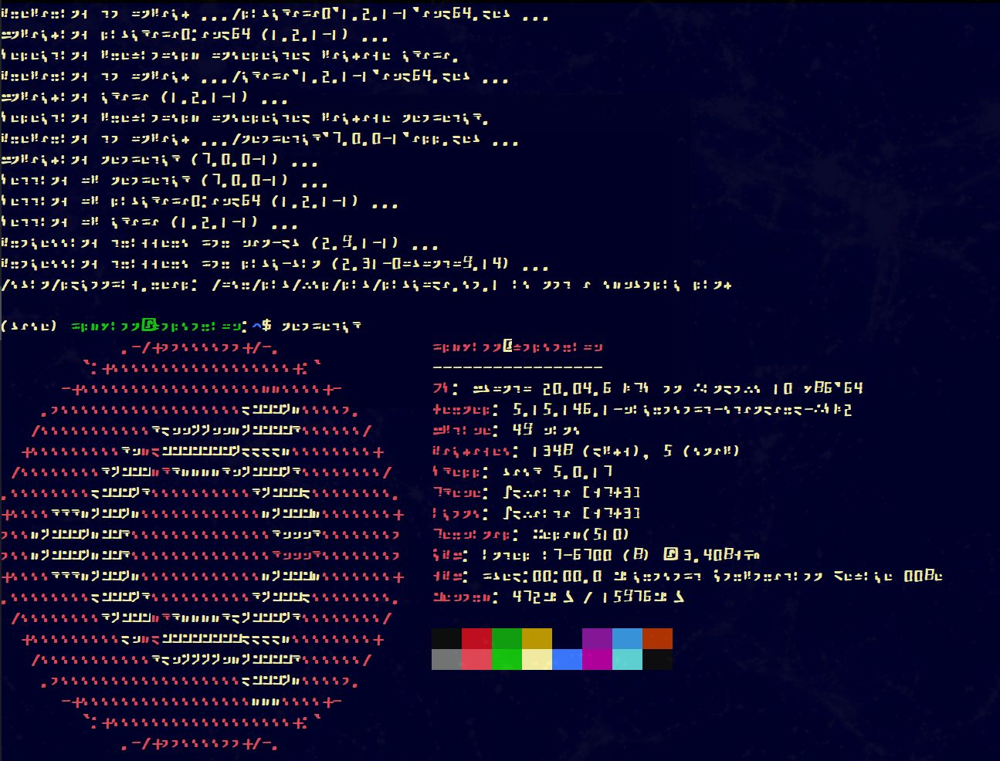

  

Systada is based on the Standard Galactic Alphabet and TeleSys.
It is meant for use with WSL, powershell, and command-line terminal emulators.

Telesys is an open source terminal font for BBSes and general terminal usage! This font is based upon FixedSys with adaptations to make it more like the Mode7 TeleText font.

  

  

  

This font is licenced under the SIL Open Font Licence v1.1 - Contributions and fixes are welcome!

    

